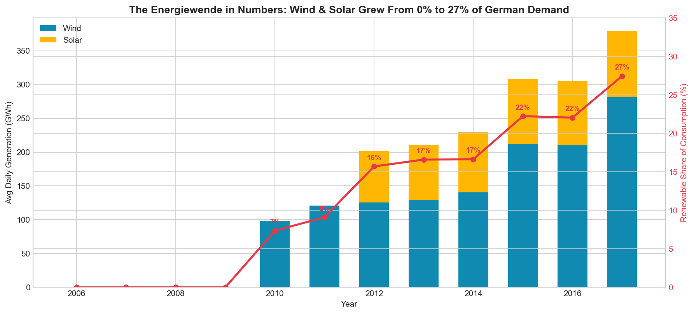
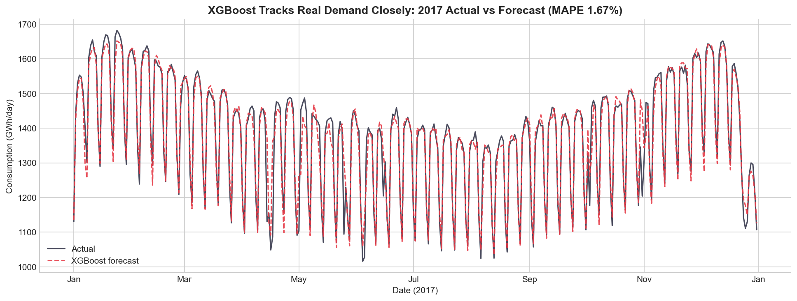
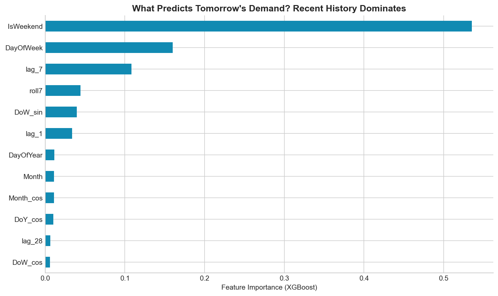

#  Powering the Energiewende: Germany Electricity Demand Forecasting (2006–2017)

An end-to-end **time series data science** project analyzing **12 years of real German power-system data** to quantify the renewable energy transition and forecast national electricity demand to within **~1.7% error** using XGBoost.

> **Data Analytics + Data Science in one pipeline:** deep exploratory analysis → insight extraction → feature engineering → predictive modeling → evaluation → business recommendations.

**Author:** Hitik Sharma · M.Sc. Computer Science, University of Passau
**Data:** [Open Power System Data (OPSD)](https://open-power-system-data.org/) — the reference open dataset for the European power system.

 **A full research-style report is included:** [`Powering_the_Energiewende_Report.pdf`](Powering_the_Energiewende_Report.pdf)

---

##  Project Highlights

| | |
|---|---|
| **Dataset** | 4,383 daily records × 12 years (2006–2017) of real German national grid data |
| **Best model** | XGBoost — **1.69% MAPE**, **R² = 0.94** on a 2-year hold-out test set |
| **Analyses** | 8 exploratory analyses, 11 publication-quality visualizations |
| **Models benchmarked** | Baseline, Linear Regression, Random Forest, XGBoost |
| **Validation** | Honest time-based split (train 2006–2015, test 2016–2017) — no look-ahead bias |

---

##  The Story: The Energiewende in Data



Between 2006 and 2017, wind and solar generation grew from **effectively 0% to 27.5%** of German electricity demand. This rising, weather-driven volatility on the supply side is exactly what makes accurate demand forecasting mission-critical for a modern grid.

---

##  Key Insights

1. **Renewables surged from 0% → 27.5%** of demand — wind tripled, solar went from nothing to a stable contributor.
2. **Demand is flat long-term** (~1,340 GWh/day) — efficiency gains offset economic and population growth.
3. **~18% weekend drop** — industrial activity creates a strong, learnable weekly cycle.
4. **~15% winter-vs-summer swing** — demand peaks in cold months and is more volatile in winter.
5. **Wind and solar are seasonally complementary** — wind peaks in winter, solar in summer, hedging each other.
6. **Demand distribution is bimodal** — the grid effectively runs in two regimes (weekday vs weekend).

---

##  Forecasting Results

The model progression more than halves the naive baseline error:

| Model | MAE (GWh) | RMSE (GWh) | MAPE | R² |
|-------|-----------|------------|------|-----|
| Baseline (lag-7) | 51.0 | 93.1 | 3.79% | 0.670 |
| Linear Regression | 32.7 | 54.3 | 2.47% | 0.888 |
| Random Forest | 22.8 | 42.7 | 1.73% | 0.930 |
| **XGBoost** | **22.4** | **39.7** | **1.69%** | **0.940** |



On unseen 2017 data, the model captures the weekly rhythm, seasonal arc, and holiday dips.

**What drives the forecast?** Recent-history features (7-day lag, rolling means) dominate, followed by day-of-week and seasonal encodings — matching grid domain intuition exactly.



---

##  Methodology

1. **Data understanding** — profiling, and correct handling of the wind (from 2010) and solar (from 2012) reporting-start gaps.
2. **Feature engineering** — calendar features, cyclical (sin/cos) encodings, lag features (1/7/14/28 days), rolling means (7/30 days).
3. **EDA** — 8 analyses covering trend, seasonality, weekly cycles, renewable growth, complementarity, distribution, correlation.
4. **Modeling** — 4 models with a time-based split, evaluated on MAE / RMSE / MAPE / R².
5. **Interpretation** — feature importance + actual-vs-predicted diagnostics.

---

##  Repository Structure

```
Germany-Energy-Demand-Forecasting/
├── Germany_Energy_Demand_Forecasting.ipynb   # Full analysis (runs top-to-bottom, outputs embedded)
├── Powering_the_Energiewende_Report.pdf       # Research-style report with methodology + citations
├── energy_analysis.py                         # Standalone script version of the pipeline
├── opsd_germany_daily.csv                     # Dataset (Open Power System Data)
├── model_results.csv                          # Model performance table
├── requirements.txt                           # Dependencies
├── README.md
└── figures/                                   # 11 publication-quality visualizations
```

---

##  How to Run

**Option A — Jupyter / VS Code (local):**
```bash
git clone https://github.com/hitiksharma/Germany-Energy-Demand-Forecasting.git
cd Germany-Energy-Demand-Forecasting
pip install -r requirements.txt
jupyter notebook Germany_Energy_Demand_Forecasting.ipynb
```

**Option B — Google Colab (no setup):**
Upload the `.ipynb` and `opsd_germany_daily.csv` to Colab and run all cells. All libraries are pre-installed.

**Option C — Script only:**
```bash
pip install -r requirements.txt
python energy_analysis.py    # regenerates all figures + model_results.csv
```

---

##  Tech Stack

**Python** · pandas · NumPy · matplotlib · seaborn · scikit-learn · XGBoost

**Techniques:** time series feature engineering, gradient boosting, random forests, time-based cross-validation, EDA, data visualization.

---

##  Data Source & References

- **Open Power System Data** — Time series of load, wind and solar generation. https://open-power-system-data.org/
- Data originally sourced from the European Network of Transmission System Operators (ENTSO-E) and the German TSOs (50Hertz, Amprion, TenneT, TransnetBW).
- T. Chen and C. Guestrin, "XGBoost: A Scalable Tree Boosting System," *Proc. 22nd ACM SIGKDD*, 2016.

---

*Built as part of an ongoing data science portfolio. Feedback welcome!*
